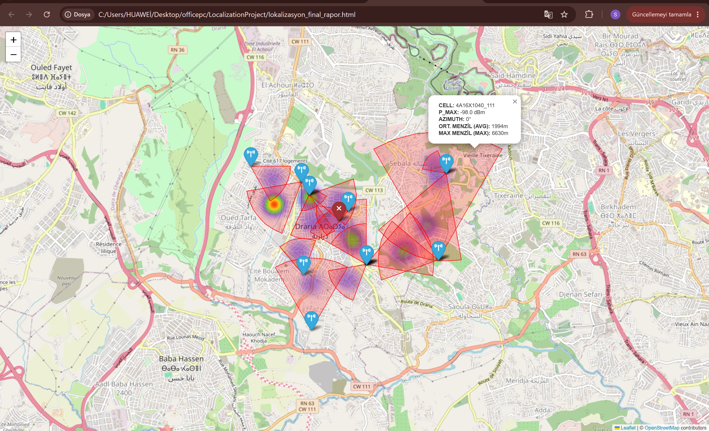
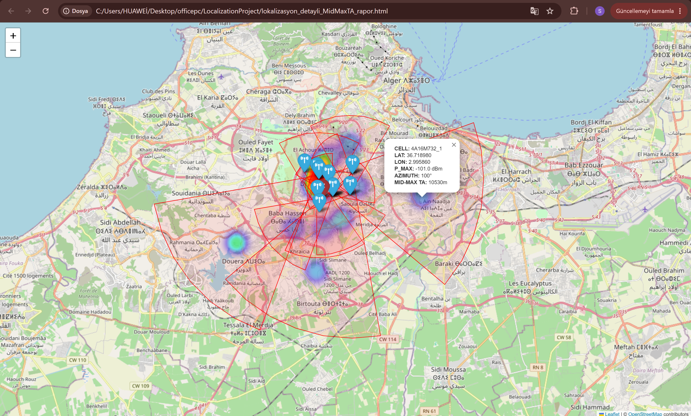
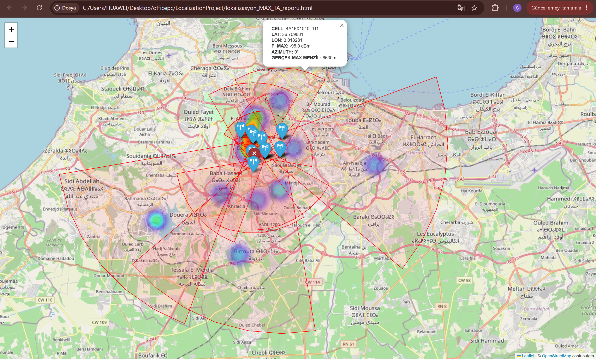
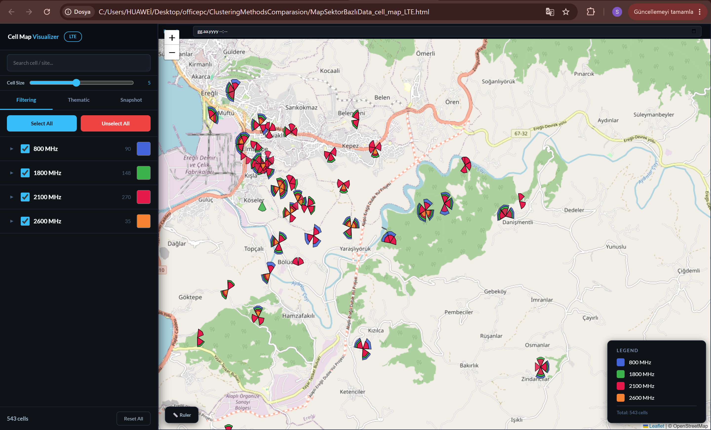
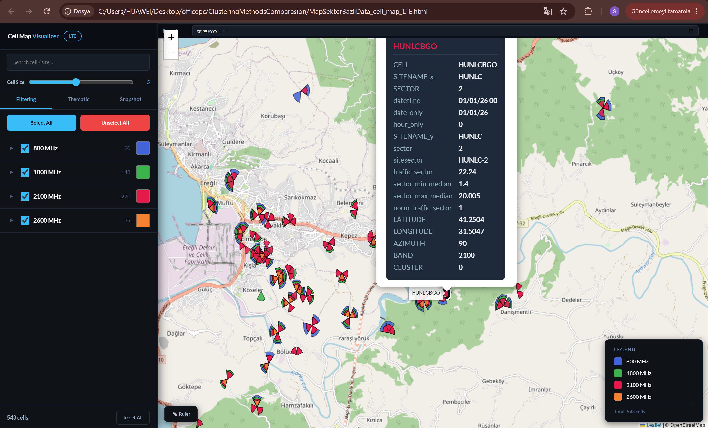

# Telecom RAN Interference Detection & Spatial Localization Suite

An end-to-end telecommunications engineering suite designed for **Radio Access Network (RAN)** topology inspection, **RF spectral interference detection**, and **Timing Advance (TA) spatial localization**.

This project provides automated tools to inspect multi-band LTE network topology, analyze physical resource block (PRB) noise patterns, and geometrically narrow down interference sources across cellular sectors.

---

## Key Modules & Methodologies

### 1. RF Interference Detection & Hybrid TA Localization
Detects anomalous uplink noise signatures across cellular sectors and bounds the geographical origin of interference using cellular propagation parameters.

* **Target Search Space Narrowing via Hybrid Timing Advance (TA):** Rather than relying solely on antenna beam azimuth directions, the system models physical distance boundaries using both Maximum TA and a hybrid Median-Maximum TA formulation—drastically narrowing the probable interference source search radius across sector baselines.
* **Spectral PRB Signature Analysis:** Generates 2D power spectrograms across Physical Resource Blocks (PRBs) over time to isolate narrowband vs. wideband interference signatures.

#### Overview & Localization Outputs
| RF Localization Overview | Spectral Interference Signature (PRB Matrix) |
| :---: | :---: |
|  |  |

#### Distance Bounding Comparison (TA Modeling)
| Mid-Max TA Estimation (Target Bound) | Max TA Baseline Estimation |
| :---: | :---: |
|  |  |

---

### 2. LTE Cell Topology & Telemetry Visualizer
An interactive GIS-based network visualizer built to inspect multi-layer cellular sectors, frequency distribution, and localized cell clustering.

* **Multi-Band Topology Inspection:** Renders sector orientation (azimuth), beamwidth, and frequency carriers (800 MHz, 1800 MHz, 2100 MHz, 2600 MHz).
* **Interactive Telemetry:** Provides on-click spatial metadata inspection (Sector ID, normalized traffic distribution, cluster labels, and coordinates).

| Full Multi-Band Topology View | On-Click Sector Telemetry Inspection |
| :---: | :---: |
|  |  |

---

## Repository Structure

```text
├── analiz_full.py                          # Core processing & localization pipeline
├── MapSektorBazlıData_cell_map_LTE.html   # Interactive LTE cell topology report
├── lokalizasyon_final_rapor.html          # Full spatial interference localization report
├── lokalizasyon_detayli_MidMaxTA_rapor.html# Detailed Mid-Max TA bounded report
├── lokalizasyon_MAX_TA_raporu.html        # Maximum TA baseline report
└── *.png                                  # Visual deliverables & telemetry previews
```
## Technical Stack & Methodologies
* **Domains:** Radio Access Networks (RAN), RF Engineering, Geospatial Analytics (GIS).
* **Core Concepts:** Timing Advance (TA) Bounding, Physical Resource Blocks (PRB), Uplink Noise Profiling, Azimuth Geometry, Sector Clustering.
* **Tools & Formats:** Python, Folium / Leaflet.js, Spatial Data Processing.
